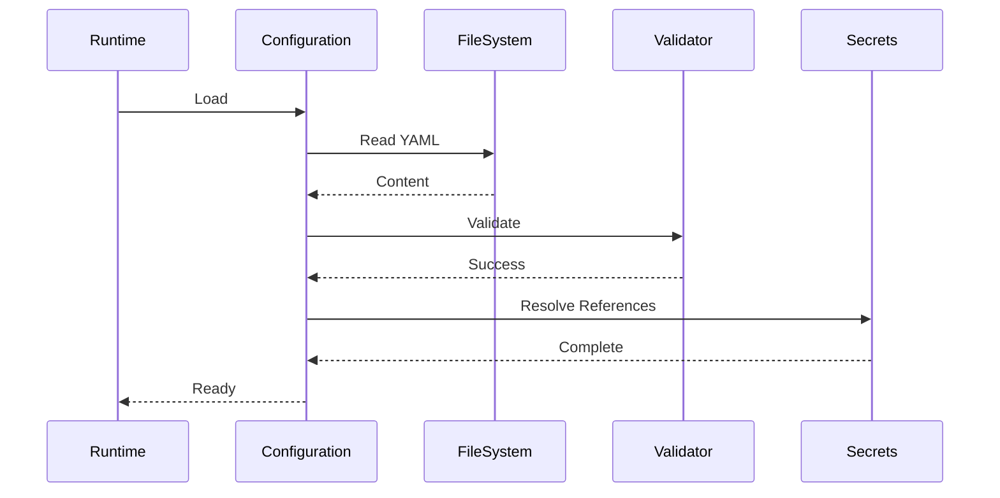

# DEVAIOS Software Requirements Specification

Document ID: SRS-012

Title: Configuration Management System

Version: 1.0

Status: Draft

Epic: Core Runtime

Priority: Critical

Depends On:
- SRS-010 Core Runtime
- SRS-011 Runtime Lifecycle

Referenced By:
- Workspace
- Plugin System
- Service System
- Installer
- Dashboard
- CLI
- Brain
- API

---

# 1. Purpose

The Configuration Management System provides a centralized,
validated, versioned, and extensible mechanism for loading,
merging, validating, updating, and distributing configuration
throughout DEVAIOS.

The configuration system SHALL be the single source of truth for
all runtime configuration.

Components SHALL NOT read configuration files directly.

---

# 2. Goals

The configuration system SHALL:

• Support local development

• Support production deployment

• Support enterprise deployment

• Support Docker

• Support Kubernetes

• Support future cloud synchronization

• Validate configuration before startup

• Prevent invalid runtime states

---

# 3. Configuration Hierarchy

Configuration SHALL be loaded in the following order.

Lowest Priority

↓

System Defaults

↓

Platform Configuration

↓

Workspace Configuration

↓

Environment Variables

↓

CLI Arguments

↓

Runtime Overrides

Highest Priority

Later sources override earlier ones.

---

# 4. Configuration Sources

Supported sources SHALL include:

Default Configuration

Platform Manifest

Workspace Manifest

Plugin Manifest

Environment Variables

Secret Providers

CLI Parameters

Runtime API

Future configuration providers MAY be added.

---

# 5. Configuration Categories

Configuration SHALL be divided into logical domains.

Platform

Runtime

Workspace

Plugins

Services

AI

Logging

Telemetry

Security

Networking

Storage

Search

Desktop

Dashboard

CLI

Each domain SHALL have an independent schema.

---

# 6. Configuration Files

Platform Configuration

```text
devai.config.yaml
```

Workspace Configuration

```text
workspace.devai.yaml
```

Plugin Configuration

```text
plugin.yaml
```

Service Configuration

```text
service.yaml
```

JSON support MAY be enabled.

YAML SHALL be the preferred format.

---

# 7. Configuration Schema

Every configuration object SHALL include:

```yaml
version:

kind:

metadata:

spec:
```

Example

```yaml
version: 1

kind: PlatformConfiguration

metadata:

  name: default

spec:

  runtime:

    profile: development

  logging:

    level: info
```

---

# 8. Functional Requirements

REQ-CONFIG-001

The system SHALL validate every configuration object.

---

REQ-CONFIG-002

Invalid configuration SHALL prevent startup.

---

REQ-CONFIG-003

Unknown configuration keys SHALL generate warnings.

Strict mode MAY reject them.

---

REQ-CONFIG-004

Configuration SHALL expose defaults.

---

REQ-CONFIG-005

Configuration SHALL support version migration.

---

REQ-CONFIG-006

Configuration SHALL support schema evolution.

---

# 9. Runtime Reload

Configuration SHALL support reloadable sections.

Reloadable:

Logging

Telemetry

Feature Flags

Themes

AI Providers

Non-reloadable:

Workspace Root

Database Engine

Storage Provider

Runtime Mode

Changes to non-reloadable settings SHALL require restart.

---

# 10. Configuration API

The Configuration Service SHALL expose:

Load()

Reload()

Get()

Set()

Validate()

Export()

Import()

Watch()

Reset()

Version()

---

# 11. Validation

Validation SHALL occur during:

Startup

Import

Update

Plugin Installation

Workspace Loading

Validation SHALL use strongly typed schemas.

Recommended implementation:

Zod

---

# 12. Configuration Watchers

Components MAY subscribe to configuration changes.

Example

```text
Logging Service

↓

Configuration Changed

↓

Reload Log Level

↓

Continue
```

Components SHALL only receive events for domains they subscribe to.

---

# 13. Events

The Configuration System SHALL emit:

ConfigurationLoaded

ConfigurationValidated

ConfigurationReloaded

ConfigurationChanged

ConfigurationImported

ConfigurationExported

ConfigurationValidationFailed

ConfigurationMigrationCompleted

---

# 14. Security

Sensitive values SHALL NOT be stored directly.

Secrets SHALL reference:

Environment Variables

Vault

1Password

Bitwarden

AWS Secrets Manager

Azure Key Vault

Google Secret Manager

Example

```yaml
database:

  password:

    secretRef:

      provider: env

      key: DATABASE_PASSWORD
```

---

# 15. Versioning

Every configuration SHALL define:

Schema Version

Platform Version

Migration Version

Migration history SHALL be retained.

---

# 16. Migration

Configuration migrations SHALL be automatic when possible.

Migration process:

Read

↓

Detect Version

↓

Backup

↓

Transform

↓

Validate

↓

Write

↓

Report

Migration SHALL never overwrite the original file without backup.

---

# 17. Profiles

Supported profiles:

Development

Testing

Production

Enterprise

Offline

Custom profiles MAY be added.

---

# 18. Failure Handling

Configuration missing

↓

Generate Default

OR

Abort

Invalid schema

↓

Abort Startup

Migration failed

↓

Rollback

Secret unavailable

↓

Retry

↓

Prompt User

↓

Abort if required

---

# 19. Performance

Configuration loading target:

< 200 ms

Validation target:

< 100 ms

Reload target:

< 50 ms

Watch notification latency:

< 20 ms

---

# 20. Sequence Diagram



---

# 21. Edge Cases

Missing file

↓

Generate template

Corrupted YAML

↓

Abort with diagnostics

Unknown version

↓

Migration required

Migration unavailable

↓

Manual intervention

Circular configuration reference

↓

Validation failure

Duplicate keys

↓

Validation warning/error

---

# 22. Acceptance Criteria

✓ Configuration loads successfully.

✓ Invalid configuration prevents startup.

✓ Configuration reload works.

✓ Secrets are never exposed.

✓ Configuration version migration succeeds.

✓ Configuration watchers receive updates.

✓ Schema validation detects invalid values.

✓ Runtime uses validated configuration only.

---

# 23. Future Enhancements

Cloud configuration synchronization

Configuration encryption

Configuration history browser

Visual configuration editor

Configuration diff viewer

Policy enforcement

Git-backed configuration

Organization-wide configuration inheritance

---

END OF DOCUMENT
