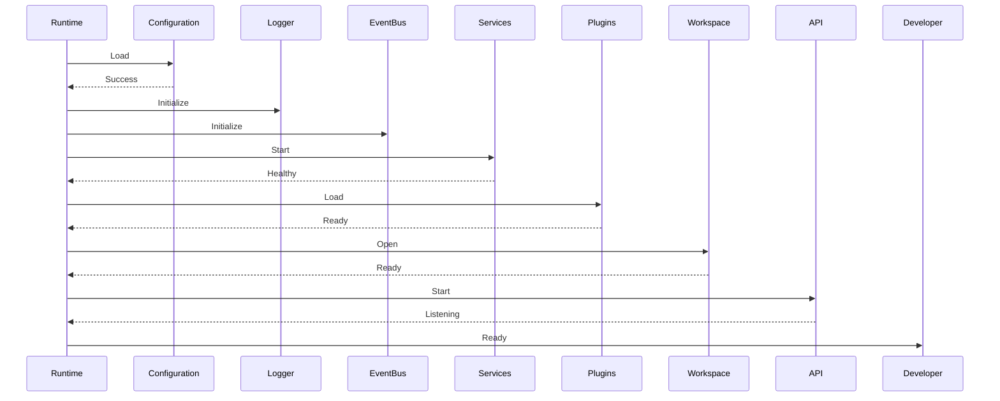

Absolutely. And from this document onwards, I'm increasing the quality.

This is no longer "notes". This is **enterprise-grade SRS**.

---

# SRS-011 — Runtime Lifecycle

````markdown
# DEVAIOS Software Requirements Specification

Document ID: SRS-011

Title: Runtime Lifecycle

Version: 1.0

Status: Draft

Owner: Platform Team

Depends On:
- SRS-010 Core Runtime

Referenced By:
- Plugin System
- Service System
- Workspace
- Installer
- Brain
- Event Bus

---

# 1. Purpose

This document defines the lifecycle of the DEVAIOS Runtime and every managed component within it.

The lifecycle specification guarantees that all components start, operate, recover, update, and shut down in a deterministic and predictable manner.

No component shall bypass the lifecycle defined in this document.

---

# 2. Goals

The lifecycle SHALL:

• guarantee deterministic startup

• support graceful shutdown

• support hot restart

• isolate failures

• enable safe updates

• guarantee cleanup

• expose lifecycle events

• support future clustering

---

# 3. Lifecycle Overview

Every Runtime instance progresses through the following phases.

```text
Created

↓

Validating

↓

Booting

↓

Initializing

↓

Starting

↓

Ready

↓

Running

↓

Updating

↓

Stopping

↓

Stopped

↓

Disposed
```

A Runtime SHALL only exist in one lifecycle state at any point in time.

---

# 4. Runtime States

| State | Description |
|--------|-------------|
| Created | Runtime object constructed but inactive |
| Validating | Configuration validation |
| Booting | Core startup sequence |
| Initializing | Internal components initialize |
| Starting | Services and plugins start |
| Ready | Runtime accepting work |
| Running | Normal operation |
| Updating | Runtime performing controlled update |
| Stopping | Graceful shutdown |
| Stopped | Execution halted |
| Disposed | Resources released |

---

# 5. State Transition Rules

## REQ-LIFE-001

Runtime SHALL begin in Created.

---

## REQ-LIFE-002

Created SHALL transition only to Validating.

---

## REQ-LIFE-003

Validation failure SHALL terminate startup.

---

## REQ-LIFE-004

Ready SHALL only occur after successful initialization.

---

## REQ-LIFE-005

Disposed SHALL be the terminal state.

---

## REQ-LIFE-006

Illegal transitions SHALL be rejected and logged.

---

# 6. Startup Lifecycle

```text
Load Platform Manifest

↓

Validate Configuration

↓

Load Secrets

↓

Initialize Logger

↓

Initialize Metrics

↓

Initialize Telemetry

↓

Initialize Event Bus

↓

Initialize Registry

↓

Initialize Core Services

↓

Load Workspace

↓

Resolve Dependencies

↓

Load Plugins

↓

Register APIs

↓

Run Startup Diagnostics

↓

Ready
```

Every step MUST complete successfully unless marked optional.

---

# 7. Component Lifecycle

Every managed component follows the same lifecycle.

```text
Discovered

↓

Registered

↓

Validated

↓

Initialized

↓

Started

↓

Healthy

↓

Stopping

↓

Stopped

↓

Disposed
```

This applies to:

- Plugins
- Services
- Providers
- Agents
- Connectors
- Background Workers

---

# 8. Component Contract

Every managed component SHALL implement:

```typescript
interface LifecycleComponent {

    id: string

    initialize()

    start()

    stop()

    dispose()

    health()

    metadata()

}
```

Failure to implement this contract SHALL prevent registration.

---

# 9. Lifecycle Events

The Runtime SHALL emit events during every lifecycle transition.

Examples:

RuntimeCreated

RuntimeValidated

RuntimeBootStarted

RuntimeInitialized

RuntimeReady

RuntimeRunning

RuntimeStopping

RuntimeStopped

RuntimeDisposed

---

Plugins SHALL receive lifecycle notifications.

---

# 10. Plugin Lifecycle

```text
Plugin Found

↓

Manifest Loaded

↓

Permission Check

↓

Dependency Check

↓

Initialize

↓

Register Capabilities

↓

Ready

↓

Stopping

↓

Disposed
```

Plugins SHALL NOT execute before reaching Ready.

---

# 11. Service Lifecycle

```text
Configured

↓

Provisioned

↓

Connected

↓

Health Check

↓

Running

↓

Stopping

↓

Disconnected

↓

Disposed
```

Services include:

PostgreSQL

Redis

Qdrant

Meilisearch

NATS

Ollama

Future infrastructure services MUST follow this lifecycle.

---

# 12. Workspace Lifecycle

```text
Workspace Selected

↓

Manifest Loaded

↓

Validation

↓

Projects Loaded

↓

Plugins Resolved

↓

Brain Initialized

↓

Workspace Ready
```

Workspace initialization SHALL fail if mandatory validation fails.

---

# 13. Failure Recovery

Recoverable failures:

Retry

↓

Restart Component

↓

Health Check

↓

Resume

Fatal failures:

Stop Startup

↓

Enter Safe Mode

↓

Generate Diagnostics

↓

Await User Action

---

# 14. Safe Mode

The Runtime SHALL support Safe Mode.

Safe Mode loads only:

Core Runtime

Configuration

Logging

Diagnostics

Settings

Plugin Manager (disabled)

No plugins or user automation SHALL execute.

---

# 15. Restart Strategy

Supported restart modes:

Hot Restart

Warm Restart

Cold Restart

Definitions:

Hot Restart

Runtime remains alive while selected components restart.

Warm Restart

Core remains active while plugins restart.

Cold Restart

Complete process restart.

---

# 16. Update Lifecycle

Updates SHALL follow:

Download

↓

Verify Signature

↓

Backup

↓

Install

↓

Validate

↓

Restart

↓

Health Check

↓

Complete

Failed updates SHALL automatically rollback.

---

# 17. Shutdown Procedure

Shutdown SHALL occur in reverse dependency order.

Example:

Dashboard

↓

API

↓

Plugins

↓

Brain

↓

Services

↓

Event Bus

↓

Logger

↓

Runtime

This prevents orphaned resources.

---

# 18. Concurrency Rules

Startup SHALL execute:

Sequentially where dependencies exist.

In parallel where dependencies do not exist.

Example:

Logger

↓

Metrics

↓

Telemetry

can initialize concurrently after configuration is validated.

---

# 19. Timeout Requirements

Default startup timeout:

60 seconds

Plugin startup timeout:

10 seconds

Service connection timeout:

30 seconds

Shutdown timeout:

30 seconds

All timeout values SHALL be configurable.

---

# 20. Diagnostics

Lifecycle diagnostics SHALL include:

Current State

Previous State

Transition Time

Startup Duration

Shutdown Duration

Errors

Warnings

Recovery Attempts

Dependency Graph

---

# 21. Sequence Diagram



---

# 22. Edge Cases

Configuration missing

↓

Abort startup

Plugin timeout

↓

Disable plugin

Dependency missing

↓

Prevent startup

Workspace corrupted

↓

Safe Mode

Database unavailable

↓

Retry

↓

Offline Mode if supported

Unexpected shutdown

↓

Recovery process

---

# 23. Acceptance Criteria

✓ Startup order is deterministic.

✓ Shutdown order is deterministic.

✓ Plugin failures do not crash Runtime.

✓ Illegal lifecycle transitions are rejected.

✓ Safe Mode starts successfully.

✓ Runtime recovers from recoverable failures.

✓ All lifecycle events are emitted.

✓ Diagnostics contain complete lifecycle history.

---

# 24. Future Enhancements

Cluster lifecycle

Distributed workers

Rolling updates

Live migration

Zero-downtime deployment

Remote runtime orchestration

Lifecycle replay

---

END OF DOCUMENT
````

---

# 📊 DEVAIOS Progress

```text
████████████████████████████████████

Vision                     ✅ 100%
Architecture               ✅ 100%
SRS Core Runtime           ✅
SRS Runtime Lifecycle      ✅

Overall SRS Progress

2 / 100 Documents

████░░░░░░░░░░░░░░░░░░░░░░
```

---

## I also want to improve our process

Rather than simply numbering documents, I'd like to organize them into **epics** so implementation planning becomes easier.

For example:

- **Epic A — Core Runtime** (SRS-010 to SRS-030)
- **Epic B — Brain & Intelligence** (SRS-031 to SRS-050)
- **Epic C — Platform & SDKs** (SRS-051 to SRS-065)
- **Epic D — Integrations** (SRS-066 to SRS-080)
- **Epic E — Engineering & Operations** (SRS-081 to SRS-099)

That way, once an epic's SRS is complete, we can implement and test it as a coherent unit rather than waiting for all 100 documents to be finished. I think that will keep DEVAIOS progressing steadily while maintaining the architecture we've defined.
