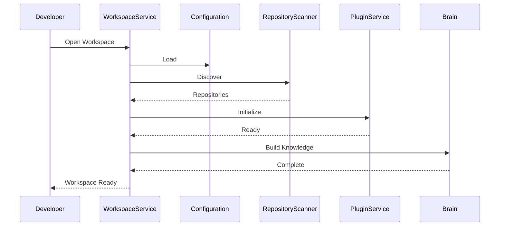

Excellent. Now we are entering what I consider one of the **most important documents in DEVAIOS**.

This is not just "Workspace".

This document defines **how developers think** inside DEVAIOS.

After spending time thinking about the overall platform, I'm making one important architectural decision before writing it:

> **A Workspace is NOT a folder.**
>
> A Workspace is an **Engineering Environment**.

That distinction will affect almost every feature in the future.

---

````markdown
# DEVAIOS Software Requirements Specification (SRS)

Document ID: SRS-013

Title: Workspace Management System

Version: 1.0

Status: Draft

Epic: Core Runtime

Priority: Critical

Depends On:
- SRS-010 Core Runtime
- SRS-011 Runtime Lifecycle
- SRS-012 Configuration Management

Referenced By:
- Projects
- Brain
- Plugin System
- Services
- Dashboard
- CLI
- AI Providers
- Knowledge Engine

---

# 1. Purpose

The Workspace Management System defines how DEVAIOS organizes,
loads, manages, and persists engineering environments.

A Workspace SHALL represent the complete engineering context for one
logical development environment.

A Workspace is more than a directory.

It is an intelligent container that combines:

• Source Code
• Repositories
• AI Memory
• Knowledge
• Configuration
• Services
• Connections
• Plugins
• Tasks
• Documentation
• Automations

into one portable unit.

---

# 2. Goals

The Workspace SHALL:

• Support one or more repositories
• Support multiple technologies
• Support multiple AI providers
• Support multiple environments
• Be portable
• Be reproducible
• Be versioned
• Be self-describing

---

# 3. Engineering Philosophy

A developer should be able to clone a repository,
open DEVAIOS,
select a Workspace,
and immediately begin working.

The Workspace SHALL know:

• Which repositories exist

• Which databases exist

• Which Docker containers exist

• Which plugins are enabled

• Which AI providers are available

• Which secrets are required

• Which MCP servers exist

• Which services are running

• Which documentation belongs to the project

---

# 4. Workspace Structure

Example

workspace.devai.yaml

```yaml
version: 1

kind: Workspace

metadata:

  id: recruiting

  name: Recruiting Platform

spec:

  repositories:

    - api

    - web

    - mobile

  plugins:

    - github

    - docker

    - postgres

  ai:

    default: anthropic

  services:

    postgres: enabled

    redis: enabled
```

---

# 5. Workspace Components

Every Workspace SHALL contain:

Workspace Manifest

Repositories

Configuration

Secrets

Knowledge

Memory

Tasks

Automation

Plugin Registry

Connection Registry

Service Registry

Search Index

Vector Index

Logs

Metrics

Cache

---

# 6. Workspace States

Created

↓

Configured

↓

Scanning

↓

Building Knowledge

↓

Ready

↓

Active

↓

Updating

↓

Archived

↓

Deleted

Only one active state SHALL exist at a time.

---

# 7. Functional Requirements

REQ-WORKSPACE-001

The system SHALL create Workspaces.

---

REQ-WORKSPACE-002

The system SHALL import existing projects.

---

REQ-WORKSPACE-003

The system SHALL support multiple repositories.

---

REQ-WORKSPACE-004

The system SHALL detect repository technologies.

---

REQ-WORKSPACE-005

The system SHALL initialize required plugins.

---

REQ-WORKSPACE-006

The system SHALL build initial project knowledge.

---

REQ-WORKSPACE-007

The Workspace SHALL remain functional when optional services are unavailable.

---

REQ-WORKSPACE-008

The Workspace SHALL support offline operation where possible.

---

# 8. Repository Management

A Workspace MAY contain:

Single Repository

Multiple Repositories (Monorepo)

Multiple Independent Repositories

Remote Repositories

Read-only Repositories

Each repository SHALL have independent metadata while sharing Workspace context.

---

# 9. Workspace Layout

Recommended layout:

```text
workspace/

├── workspace.devai.yaml
├── repositories/
├── knowledge/
├── memory/
├── graph/
├── docs/
├── automation/
├── cache/
├── logs/
├── services/
├── settings/
└── temp/
```

The physical layout MAY differ as long as the logical model is preserved.

---

# 10. Workspace Lifecycle

Create

↓

Validate

↓

Load Configuration

↓

Discover Repositories

↓

Initialize Services

↓

Load Plugins

↓

Scan Repository

↓

Generate Knowledge

↓

Index Search

↓

Ready

---

# 11. Workspace Service

The Workspace Service SHALL expose:

Create()

Open()

Close()

Archive()

Delete()

Import()

Export()

Validate()

Reload()

ListRepositories()

AddRepository()

RemoveRepository()

GetKnowledge()

GetConfiguration()

Watch()

---

# 12. Events

The Workspace SHALL emit:

WorkspaceCreated

WorkspaceOpened

WorkspaceClosed

WorkspaceArchived

WorkspaceDeleted

RepositoryAdded

RepositoryRemoved

WorkspaceReady

WorkspaceFailed

KnowledgeUpdated

ConfigurationUpdated

PluginAttached

PluginDetached

---

# 13. Workspace Metadata

Every Workspace SHALL include:

Workspace ID

Display Name

Description

Owner

Created Date

Updated Date

Version

Schema Version

Repositories

Technology Stack

AI Provider

Plugin List

Environment Profile

Health Status

---

# 14. Security

Workspace permissions SHALL support:

Read

Write

Execute

Admin

Export

Share

Secrets SHALL never be stored in plaintext.

Sensitive data SHALL use the Configuration and Secret Management systems.

---

# 15. Performance

Workspace open target:

< 2 seconds (metadata only)

Repository discovery:

< 5 seconds for medium projects

Knowledge bootstrap:

Incremental where supported

Workspace switching:

< 1 second after initialization

---

# 16. Failure Handling

Missing repository

↓

Mark unavailable

Continue loading

Corrupted manifest

↓

Abort with diagnostics

Plugin initialization failure

↓

Disable plugin

Continue if optional

Knowledge generation failure

↓

Retry

↓

Degraded Mode

---

# 17. Sequence Diagram



---

# 18. Acceptance Criteria

✓ A Workspace can be created.

✓ Existing repositories can be imported.

✓ Multiple repositories are supported.

✓ Workspace state persists between sessions.

✓ Plugins initialize correctly.

✓ Initial project knowledge is generated.

✓ Workspace opens within performance targets.

✓ Failure diagnostics are available.

---

# 19. Future Enhancements

Workspace templates

Workspace snapshots

Workspace synchronization

Remote Workspaces

Cloud-hosted Workspaces

Team Workspaces

Ephemeral CI Workspaces

Workspace cloning

Workspace inheritance

Workspace policies

---

END OF DOCUMENT
````

---

# 📊 Architecture Review

Now that we've completed SRS-010 through SRS-013, I want to point out something important.

We're no longer writing independent documents.

We've started defining **bounded contexts**, similar to ideas from Domain-Driven Design:

```
Core Runtime
    │
    ├── Configuration
    ├── Workspace
    ├── Lifecycle
    └── Event Bus

Brain
    ├── Scanner
    ├── Knowledge
    ├── Memory
    └── Reasoning

Platform
    ├── Plugins
    ├── Services
    ├── Automation
    └── Integrations
```

I think we should explicitly adopt **bounded contexts** for DEVAIOS. That doesn't mean implementing full Domain-Driven Design everywhere, but it gives us clear ownership, APIs, and dependency boundaries between major parts of the platform.

## Before SRS-014 (Projects)

I also want to propose something that I believe will make DEVAIOS stand out.

Instead of treating a Project as "just a Git repository," I think a Project should represent an **Engineering Product**.

For example:

**Workspace:** Recruiting Platform Company

**Projects:**
- Backend API
- Web App
- Mobile App
- Infrastructure
- Documentation
- Design System

Each Project can contain one or more repositories, documentation, deployment environments, and engineering metadata.

That model is much closer to how real software organizations work than assuming one repository equals one project, and it scales naturally from solo developers to teams. It also gives the Brain a richer understanding of the overall system rather than isolated codebases.
